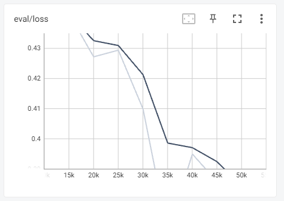
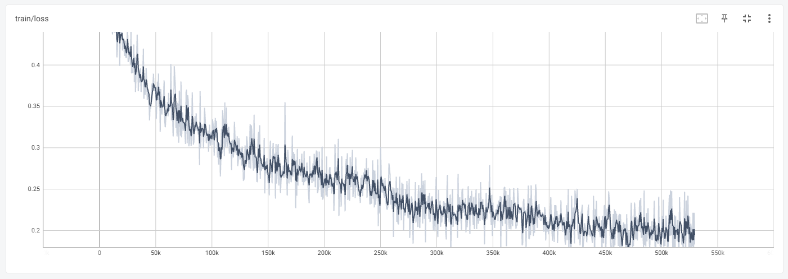
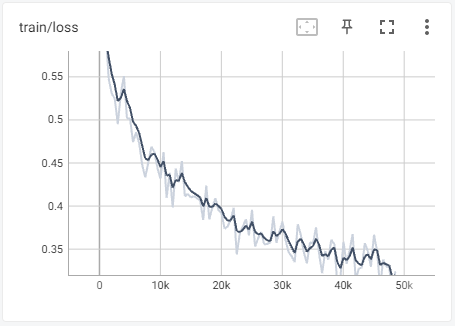
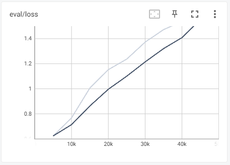

# CS330-Project

## Data
- classification task data are adapted from [natural-instructions](https://github.com/allenai/natural-instructions)
- we follow the split specified in natural-instructions/splits/default
    - we select classification tasks from train_tasks.txt for our train/validation set
    - we select classification tasks from test_tasks.txt for our test (eval) set

### Data sample
First 10 textual entailment tasks: `eval/textual_entailment_first10.txt`

All textual entailment tasks: `eval/textual_entailment.txt`

Note: task 463, 464, and 534 are removed because they are non-English.

Read from txt and download tasks to `tasks/` folder: `python utils/download_tasks.py`

## Run Tk-Instruct predictions

Specify whether to use full textual entailment tasks or first 10 textual entailment tasks in `Tk-Instruct/src/ni_dataset.py` 
```
            datasets.SplitGenerator(
                name=datasets.Split.TEST,
                gen_kwargs={
                    # "path": os.path.join(split_dir, "textual_entailment_first10.txt"), 
                    "path": os.path.join(split_dir, "textual_entailment.txt"), 
                    "task_dir": task_dir, 
                    "max_num_instances_per_task": self.config.max_num_instances_per_eval_task,
                    "subset": "test"
                }),
```
Specifiy model configuration (`allenai/tk-instruct-small-def-pos` or `allenai/tk-instruct-base-def-pos`) and output directory in `scripts/eval_tk_instruct.sh`

Run prediction on textual entailment tasks using tkinstruct model: 
```
cd Tk-Instruct/
source scripts/eval_tk_instruct.sh
```

Predictions and metrics are saved at: `Tk-Instruct/output/`

Note: it seems that `tk-instruct-small-def-pos` actually has a better eval exact match accuracy on textual entailment tasks than the larger `allenai/tk-instruct-base-def-pos` model. 

- dependencies:
    - `pip install -r requirements.txt`
    - `pip install -r Tk-Instruct/requirements.txt`

## GPT-3 prompt engineering
#### Paraphrase
Run `paraphrase_prompts.py` with desired arguments. The script uses `paraphrase.prompt` as its default template. The generated results have the following signature:
```
    {
        "orignal_task": "task*.json",
        'engine': GPT-3 generation engine,
        'template': paraphrase.prompt,
        "original_prompt": "",
        "generated_prompts": []
    }
```

#### Augment (append choice explanation to the original instruction)
Run `choice_expl_prompts.py` with desired arguments. The script uses `choice_expl.prompt` as its template and stores generated prompts by default at `gpt3-augment-results`. 
The generated results share the above signature.

- dependencies:
    - `pip install -r requirements.txt`
    - `export OPENAI_API_KEY=[YOUR_API_KEY]`

## Run Tk-Instruct with GPT-3 prompts

### Generate new tasks using GPT-3 paraphrased/augmented prompts
#### Paraphrase
Run `generate_gpt3_tasks.py` to fetch paraphrased prompts from `/gpt3-paraphrase-results-tk-instruct-train`, replace original prompts in `/tk-instruct-train-classfication-tasks` 
with paraphrased prompts, store each new task in `/gpt3-paraphrase-tasks-tk-instruct-train`， then return the list of new task names in `eval/textual_entailment_gpt3_paraphrase.txt`.

#### Augment (append choice explanation to the original instruction)
Run `generate_gpt3_tasks.py` to fetch paraphrased prompts from `/gpt3-augment-results`, replace original prompts in `/tasks` 
with paraphrased prompts, store each new task in `/gpt-augment-tasks`， then return the list of new task names in `/eval/textual_entailment_gpt3_augment.txt`.

### Create test references for the new tasks
In `/eval/create_reference_file.py`, update `tasks_dir`, `test_path` and save to `eval/test_references_gpt3_paraphrase.jsonl`.

### Run Tk-Instruct inference using paraphrased/augmented prompts
Specify paraphrased textual entailment tasks in `Tk-Instruct/src/ni_dataset.py`.
```
            datasets.SplitGenerator(
                name=datasets.Split.TEST,
                gen_kwargs={
                    # "path": os.path.join(split_dir, "textual_entailment_first10.txt"), 
                    # "path": os.path.join(split_dir, "textual_entailment.txt"), 
                    "path": os.path.join(split_dir, "textual_entailment_gpt3.txt"), # paraphrase
                    # "path": os.path.join(split_dir, "textual_entailment_gpt3.txt"), # augment
                    "task_dir": task_dir, 
                    "max_num_instances_per_task": self.config.max_num_instances_per_eval_task,
                    "subset": "test"
                }),
```

In `scripts/eval_tk_instruct.sh`, replace 
```
    --task_dir ../tasks
```
with
```
    --task_dir ../gpt3-tasks
```
for paraphrased prompts, or 
```
    --task_dir ../gpt3-augment-tasks
```
for augmented prompts

Specify your own cache location, then run prediction on the paraphrased/augmented textual entailment tasks using tkinstruct model: 
```
cd Tk-Instruct/
source scripts/eval_tk_instruct.sh
```
Predictions and metrics are saved at: `Tk-Instruct/output/` as before.

### Run prompt ensemble
Specify whether to find majority vote or find best paraphrase in `Tk-Instruct/src/ensemble_paraphrased_prompts.py`

Specify input/output paths

Then run
```
cd Tk-Instruct/src
python ensemble_paraphrased_prompts.py
```

### Compute standard deviation of paraphrases
Set `find_paraphrase_metrics(args.metrics_path, args.output_path, args.k, best=True, paraphrase_save_file=args.paraphrase_save_file)` in the main function of `Tk-Instruct/src/ensemble_paraphrased_prompts.py`

Specify input/paraphrase_save_file paths

Run
```
cd Tk-Instruct/src
python ensemble_paraphrased_prompts.py
```

Specify paraphrase_save_file and run
```
cd ../../
python utils/find_paraphrases_std.py
```


### Train Tk-Instruct

#### First experiment

Finetune Tk-Instruct on dataset `/gpt3-paraphrase-tasks-tk-instruct`.

Run `splits/make_splits.py` to split this dataset for training, validation, and testing. A list of task names are saved in files `train_tasks.txt`, `dev_tasks.txt`, and `test_tasks.txt` respectively. Run `splits/save_tests.py` if you want to save the train and test datasets to separate folders.

Specify the txt filenames in the `_split_generators` function in `Tk-Instruct/src/ni_dataset.py`.

Specifiy model configuration (`allenai/tk-instruct-small-def-pos`) and output directory in `scripts/train_tk_instruct.sh`. The `-bfloat16` tag is removed from this script and from the config file due to Nvidia M60 GPU limitations. Argument `save_total_limit = 1` is added to `run_s2s.py` to save the last checkpoint only and save disk space.

Fine-tune tkinstruct model on paraphrased prompts: 
```
cd Tk-Instruct/
source scripts/train_tk_instruct.sh
```
Training metrics and results are saved at: `/output/finetune`. Note that some files (e.g., model checkpoints and .jsonl) are too large to save in Github.


The prediction results on `test_tasks` by the original and finetuned Tk-Instruct model are stored in `Tk-Instruct/output/gpt3-paraphrase-tasks-tk-instruct-train-test` and `Tk-Instruct/output/gpt3-paraphrase-tasks-tk-instruct-train-test-finetuned`.

The original model has a predict_exact_match of 48.4846, while the finetuned model has a predict_exact_match of 77.2986 which is a significant improvement.

#### Experiment v1
A validation set is added to track the model's performance on unseen tasks. Both training and validation loss for this model are decreasing as training proceeds which is a good sign.

 

#### Experiment v2

In the first attempt, the default split was chosen to be 80-10-10 with random sampling. This means that very similar tasks (i.e., same task with different paraphrased prompts) can be present in both the training and test set. To prevent data leakage, it may be beneficial to use completely different tasks for testing. In addition, Tk-Instruct documentation states that "We found it unclear what should be a meaningful validation set, under such cross-task generalization setting." For this purpose, in a second attempt:

Run `splits/make_splits_v2.py` to split this dataset for training and testing (no validation). First 80% of tasks are used for training and last 20% of tasks are used for testing. A list of task names are saved in files `train_tasks_v2.txt`, `dev_tasks_v2.txt`, and `test_tasks_v2.txt` respectively. The test set is named `gpt3-paraphrase-tasks-tk-instruct-test`. Training metrics and results are saved at: `/output/finetune_v2`. 



The prediction results on `test_tasks_v2` by the original and finetuned Tk-Instruct model are stored in `Tk-Instruct/output/gpt3-paraphrase-tasks-tk-instruct-finetuned-v2` and `Tk-Instruct/output/gpt3-paraphrase-tasks-tk-instruct-notfinetuned-v2`. 

The original model has a predict_exact_match of 48.5091, while the finetuned model has a predict_exact_match of 46.1247 which is slightly lower. Only the predict_exact_match_for_sentiment_analysis is higher than the original model. One hypothesis is that the model has overfit to the training data during finetuning and does not generalize as well to unseen prompts, especially with a small learning rate of 1e-5 and a very large number of training samples of 529836.

Another observation that these evaluation scores are still higher than the predict_exact match from our previous experiments with 16 paraphrased prompts, which was around 40. This may be attributed to the improvement we made when prompting GPT-3 to generate higher-quality paraphrases.

It appears that as we hypothesized, the model becomes less sensitive to different wordings after finetuning. The standard deviation among different paraphrases averaged across all tasks in the test split drops drastically from 5.1135 to 1.4318.

 Note that the predictions mentioned above are made on tasks with paraphrased prompts. The predict_exact_match on original, non-paraphrased prompts (`splits/test_tasks_v2_original.txt`) is 47.0546. These results are saved in `Tk-Instruct/output/gpt3-paraphrase-tasks-tk-instruct-finetuned-v2-original-instruction`.

#### Experiment v3
A validation set is added to track the model's performance on unseen tasks. The validation loss keeps increasing which confirms our hypothesis that the model is overfitting.

 

#### Experiment v4
Randomly sample 8 instances for each paraphrase so that each task has 32 * 8 = 256 instances. The training and evaluation data is stored in `gpt3-paraphrase-tasks-tk-instruct-train-top8` and `gpt3-paraphrase-tasks-tk-instruct-test-top8`. The output is stored in `Tk-Instruct/output/finetuned-v4-original-instruction`. The validation loss still increases with training, but the "predict_exact_match" on original prompts (`splits/test_tasks_v2_original.txt`) is 50.3592 which is an improvement from v2 (47.0546). This is also slightly better than the non-finetuned, original model, which has a "predict_exact_match" of 50.3352. The results from the original model are saved in `Tk-Instruct/output/notfinetuned-original-instruction`.


#### Experiment v5
Randomly sample 3 instances for each paraphrase so that each task has 32 * 3 = 96 instances. The training and evaluation data is stored in `gpt3-paraphrase-tasks-tk-instruct-train-top3` and `gpt3-paraphrase-tasks-tk-instruct-test-top3`. The output is stored in `Tk-Instruct/output/finetuned-v5-original-instruction`. The validation loss still increases with training, but the "predict_exact_match" on original prompts further improves to 50.4789. This is even better than the original model!


### Train prompt quality classification/regression model
Preprocess paraphrases from predict_results.json:
```
cd Tk-Instruct/src/
python Tk-Instruct/src/ensemble_paraphrased_prompts.py
```

Specify task type (classification or regression) in `train_prompt_quality_classifier.py`. Load training data from `prompt_quality_data/` and run training:
```
python train_prompt_quality_classifier.py
```

### Experiments tracking

Eval set: all 24 English textual entailment tasks (`eval/textual_entailment.txt`) 
Note: task 463, 464, and 534 are removed because they are non-English.

Metrics: Average Exact Match over the 24 English textual entailment tasks

Model: `allenai/tk-instruct-small-def-pos`

| Baseline (original instruction) | Augmented (choice explanation)| Average of 16 paraphrased prompts | Majority vote of 16 paraphrased prompts | Best of 16 paraphrased prompts | Worst of 16 paraphrased prompts | 
| ---- | ---- |  ---- |  ---- | ---- | ---- | 
| 39.5833 | 41.25 | 40.2188 | 40.0833 | 43.8333 | 37.2916 | 


#### Prompt Quality Model

Evaluation loss of regression and classification model are both diverging, which indicates that there might not exist some rule to tell whether it is a good paraphrase or not. 


#### Semantic textual similarity between paraphrase and original instruction vs exact match accuracy
Command: `python semantic_textual_similarity.py`

There is a minor positive correlation of 0.05815013. 


